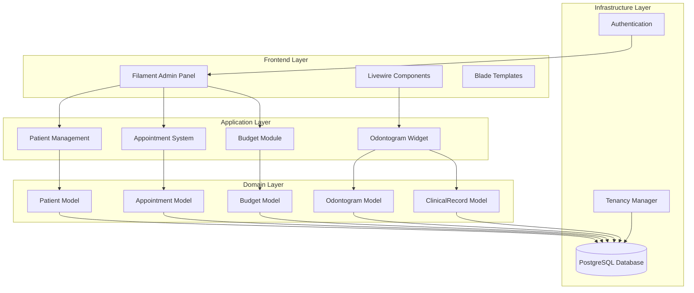
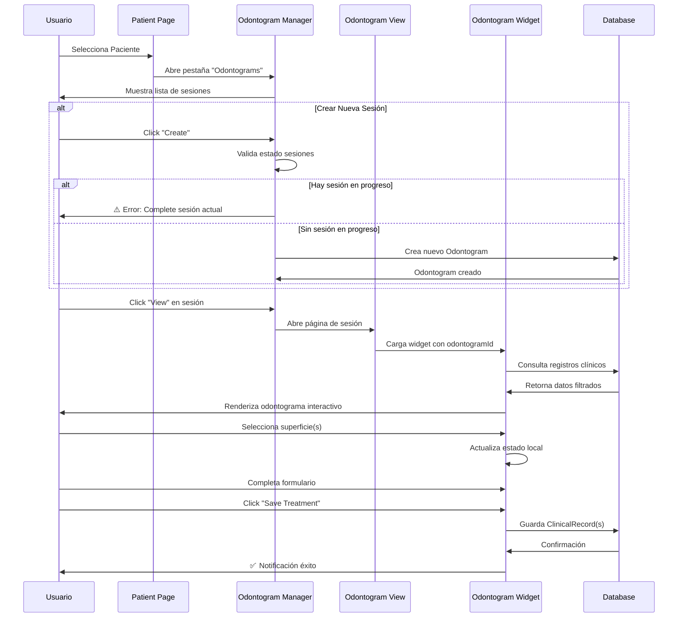

# DentalFlow SaaS

> **Sistema de Gestión Dental Multi-Tenant con Odontograma Interactivo**

DentalFlow SaaS es una plataforma completa de gestión para clínicas dentales que permite administrar pacientes, citas, presupuestos y un odontograma interactivo avanzado con historial clínico por sesiones.


---

## 📋 Tabla de Contenidos

- [Características](#-características)
- [Arquitectura del Sistema](#-arquitectura-del-sistema)
- [Requisitos Previos](#-requisitos-previos)
- [Instalación](#-instalación)
- [Configuración](#-configuración)
- [Uso del Sistema](#-uso-del-sistema)
- [Estructura de Base de Datos](#-estructura-de-base-de-datos)
- [Desarrollo](#-desarrollo)

---

## ✨ Características

### 🏥 Gestión Multi-Tenant
- Sistema multi-clínica con aislamiento completo de datos
- Dominios personalizados por tenant
- Gestión centralizada desde panel de administración

### 👥 Gestión de Pacientes
- Registro completo de pacientes
- Historial médico y alergias
- Documentos y notas clínicas

### 📅 Sistema de Citas
- Calendario interactivo
- Gestión de horarios y disponibilidad
- Notificaciones automáticas

### 💰 Presupuestos
- Creación de presupuestos detallados
- Ítems de tratamiento personalizables
- Seguimiento de estados

### 🦷 Odontograma Interactivo Avanzado
- **SVG interactivo** con 5 superficies por diente + raíz
- **Multi-selección** de superficies para tratamientos en lote
- **Historial por sesiones** - múltiples odontogramas por paciente
- **Sistema de estados** - control de sesiones en progreso/completadas
- **Panel flotante** no bloqueante para edición
- **Códigos de diagnóstico** con colores visuales
- **Registro clínico** detallado por superficie

---

## 🏗️ Arquitectura del Sistema

### Diagrama de Componentes



### Flujo de Odontograma



### Modelo de Datos del Odontograma

```mermaid
erDiagram
    PATIENTS ||--o{ ODONTOGRAMS : "has many"
    ODONTOGRAMS ||--o{ CLINICAL_RECORDS : "contains"
    
    PATIENTS {
        bigint id PK
        string tenant_id FK
        string name
        string email
        string phone
        string rut
        date birth_date
        json allergies
        timestamps
    }
    
    ODONTOGRAMS {
        bigint id PK
        string tenant_id FK
        bigint patient_id FK
        string name
        date date
        text notes
        string status "in_progress|completed"
        timestamps
    }
    
    CLINICAL_RECORDS {
        bigint id PK
        string tenant_id FK
        bigint patient_id FK
        bigint odontogram_id FK
        integer tooth_number "11-48"
        string surface "top|bottom|left|right|center|root"
        string diagnosis_code "caries|filled|endodontic|missing|crown|healthy"
        string treatment_status "planned|completed|existing"
        text notes
        timestamps
    }
```

---

## 📦 Requisitos Previos

Antes de instalar DentalFlow SaaS, asegúrate de tener:

- **PHP** >= 8.3
- **Composer** >= 2.0
- **Node.js** >= 18.x
- **npm** >= 9.x
- **PostgreSQL** >= 14
- **Git**

### Verificar Requisitos

```bash
# Verificar versión de PHP
php -v

# Verificar Composer
composer --version

# Verificar Node.js
node -v

# Verificar npm
npm -v

# Verificar PostgreSQL
psql --version
```

---

## 🚀 Instalación

### 1. Clonar el Repositorio

```bash
git clone https://github.com/rommelescorihuela/dentalflowsaas.git
cd dentalflowsaas
```

### 2. Instalar Dependencias PHP

```bash
composer install
```

### 3. Instalar Dependencias JavaScript

```bash
npm install
```

### 4. Configurar Variables de Entorno

```bash
# Copiar archivo de ejemplo
cp .env.example .env

# Generar clave de aplicación
php artisan key:generate
```

### 5. Configurar Base de Datos

Edita el archivo `.env` con tus credenciales de PostgreSQL:

```env
DB_CONNECTION=pgsql
DB_HOST=127.0.0.1
DB_PORT=5432
DB_DATABASE=dentalflow_saas
DB_USERNAME=tu_usuario
DB_PASSWORD=tu_contraseña
```

### 6. Crear Base de Datos

```bash
# Conectar a PostgreSQL
psql -U postgres

# Crear base de datos
CREATE DATABASE dentalflow_saas;

# Salir
\q
```

### 7. Ejecutar Migraciones

```bash
php artisan migrate
```

### 8. Crear Usuario Administrador

```bash
php artisan make:filament-user
```

Sigue las instrucciones para crear tu usuario administrador.

### 9. Compilar Assets

```bash
# Desarrollo
npm run dev

# Producción
npm run build
```

### 10. Iniciar Servidor

```bash
php artisan serve
```

Accede a la aplicación en: `http://localhost:8000`

---

## ⚙️ Configuración

### Configuración de Tenancy

El sistema usa **Stancl Tenancy** para multi-tenancy. Para crear un nuevo tenant:

```bash
php artisan tenants:create
```

### Configuración de Dominios

Edita `config/tenancy.php` para configurar dominios personalizados por tenant.

### Configuración de Filament

Los paneles de Filament se encuentran en:
- **Admin Panel**: `/admin` - Gestión de tenants
- **App Panel**: `/app` - Panel principal de la clínica

---

## 📖 Uso del Sistema

### Flujo de Trabajo Completo

```mermaid
flowchart TD
    Start([Inicio]) --> Login[Iniciar Sesión]
    Login --> Dashboard[Dashboard]
    
    Dashboard --> Patients[Gestión de Pacientes]
    Dashboard --> Appointments[Citas]
    Dashboard --> Budgets[Presupuestos]
    
    Patients --> CreatePatient[Crear Paciente]
    CreatePatient --> PatientDetail[Detalle del Paciente]
    
    PatientDetail --> OdontogramTab[Pestaña Odontograms]
    OdontogramTab --> CheckStatus{¿Hay sesión<br/>en progreso?}
    
    CheckStatus -->|Sí| EditCurrent[Editar Sesión Actual]
    CheckStatus -->|No| CreateSession[Crear Nueva Sesión]
    
    CreateSession --> SessionCreated[Sesión Creada]
    SessionCreated --> OpenOdontogram[Abrir Odontograma]
    
    EditCurrent --> OpenOdontogram
    
    OpenOdontogram --> SelectSurfaces[Seleccionar Superficie(s)]
    SelectSurfaces --> MultiSelect{¿Multi-selección?}
    
    MultiSelect -->|Sí| BatchForm[Formulario Batch]
    MultiSelect -->|No| SingleForm[Formulario Individual]
    
    BatchForm --> FillForm[Completar Diagnóstico]
    SingleForm --> FillForm
    
    FillForm --> SaveTreatment[Guardar Tratamiento]
    SaveTreatment --> UpdateMap[Actualizar Mapa Visual]
    
    UpdateMap --> MoreTreatments{¿Más<br/>tratamientos?}
    MoreTreatments -->|Sí| SelectSurfaces
    MoreTreatments -->|No| CompleteSession{¿Completar<br/>sesión?}
    
    CompleteSession -->|Sí| MarkComplete[Marcar como Completada]
    CompleteSession -->|No| BackToPatient[Volver a Paciente]
    
    MarkComplete --> BackToPatient
    BackToPatient --> End([Fin])
```

### 1. Gestión de Pacientes

#### Crear un Paciente

1. Ve a **Patients** en el menú lateral
2. Click en **New Patient**
3. Completa el formulario:
   - Nombre
   - Email
   - Teléfono
   - RUT/DNI
   - Fecha de nacimiento
   - Alergias (opcional)
4. Click **Create**

#### Editar Paciente

1. Click en el paciente en la lista
2. Modifica los datos necesarios
3. Click **Save changes**

### 2. Sistema de Odontogramas

#### Crear una Sesión de Odontograma

1. Abre un paciente
2. Ve a la pestaña **Odontograms**
3. Click **Create**
4. Completa:
   - **Name**: Ej. "Consulta Inicial Enero 2026"
   - **Date**: Fecha de la sesión
   - **Status**: In Progress (por defecto)
   - **Notes**: Notas de la sesión (opcional)
5. Click **Create**

> ⚠️ **Nota**: Solo puedes crear una nueva sesión si no hay ninguna "In Progress"

#### Trabajar en el Odontograma

1. Click en el ícono **View** (ojo) de la sesión
2. Se abre el odontograma interactivo
3. **Seleccionar superficie(s)**:
   - Click en una superficie → Selección simple
   - Click en múltiples superficies del mismo diente → Multi-selección
   - Las superficies seleccionadas se resaltan en **cyan**
4. Aparece el **panel flotante** con el formulario
5. Completa:
   - **Diagnosis / Status**: Tipo de diagnóstico
   - **Treatment status**: Planned/Completed/Existing
   - **Notes**: Notas específicas
6. Click **Save Treatment**
7. El odontograma se actualiza con los colores correspondientes

#### Códigos de Diagnóstico y Colores

| Código | Color | Descripción |
|--------|-------|-------------|
| `caries` | 🔴 Rojo | Caries |
| `filled` | 🔵 Azul | Restauración/Empaste |
| `endodontic` | 🟡 Amarillo | Tratamiento Endodóntico |
| `missing` | ⚫ Negro | Pieza Faltante |
| `crown` | 🟣 Púrpura | Corona |
| `healthy` | ⚪ Blanco | Sano |

#### Completar una Sesión

1. En la página del odontograma, click **Edit**
2. Cambia **Status** a **Completed**
3. Click **Save**
4. Ahora podrás crear una nueva sesión

#### Ver Historial

1. En la pestaña **Odontograms** del paciente
2. Verás todas las sesiones con:
   - Nombre
   - Fecha
   - Estado (badge de color)
   - Cantidad de registros
3. Click **View** para ver cualquier sesión histórica

### 3. Gestión de Citas

1. Ve a **Appointments**
2. Click **New Appointment**
3. Selecciona:
   - Paciente
   - Fecha y hora
   - Tipo de tratamiento
   - Notas
4. Click **Create**

### 4. Presupuestos

1. Ve a **Budgets**
2. Click **New Budget**
3. Selecciona paciente
4. Agrega ítems de tratamiento
5. El total se calcula automáticamente
6. Click **Create**

---

## 🗄️ Estructura de Base de Datos

### Tablas Principales

```mermaid
erDiagram
    TENANTS ||--o{ USERS : manages
    TENANTS ||--o{ PATIENTS : owns
    TENANTS ||--o{ APPOINTMENTS : schedules
    TENANTS ||--o{ BUDGETS : creates
    
    PATIENTS ||--o{ ODONTOGRAMS : "has history"
    PATIENTS ||--o{ APPOINTMENTS : attends
    PATIENTS ||--o{ BUDGETS : receives
    
    ODONTOGRAMS ||--o{ CLINICAL_RECORDS : contains
    
    BUDGETS ||--o{ BUDGET_ITEMS : includes
    
    TENANTS {
        string id PK
        string name
        timestamps
    }
    
    USERS {
        bigint id PK
        string tenant_id FK
        string name
        string email
        string password
        timestamps
    }
    
    PATIENTS {
        bigint id PK
        string tenant_id FK
        string name
        string email
        string phone
        string rut
        date birth_date
        json allergies
        timestamps
    }
    
    ODONTOGRAMS {
        bigint id PK
        string tenant_id FK
        bigint patient_id FK
        string name
        date date
        text notes
        string status
        timestamps
    }
    
    CLINICAL_RECORDS {
        bigint id PK
        string tenant_id FK
        bigint patient_id FK
        bigint odontogram_id FK
        integer tooth_number
        string surface
        string diagnosis_code
        string treatment_status
        text notes
        timestamps
    }
    
    APPOINTMENTS {
        bigint id PK
        string tenant_id FK
        bigint patient_id FK
        datetime scheduled_at
        string status
        text notes
        timestamps
    }
    
    BUDGETS {
        bigint id PK
        string tenant_id FK
        bigint patient_id FK
        decimal total
        string status
        timestamps
    }
    
    BUDGET_ITEMS {
        bigint id PK
        bigint budget_id FK
        string description
        decimal amount
        integer quantity
        timestamps
    }
```

---

## 🛠️ Desarrollo

### Estructura del Proyecto

```
dentalflowsaas/
├── app/
│   ├── Filament/
│   │   ├── Admin/          # Panel de administración
│   │   └── App/            # Panel principal
│   │       └── Resources/
│   │           └── Patients/
│   │               ├── PatientResource.php
│   │               ├── Pages/
│   │               │   └── ViewOdontogram.php
│   │               └── RelationManagers/
│   │                   └── OdontogramsRelationManager.php
│   ├── Livewire/
│   │   └── Odontogram.php  # Widget principal
│   └── Models/
│       ├── Patient.php
│       ├── Odontogram.php
│       └── ClinicalRecord.php
├── database/
│   └── migrations/
├── resources/
│   └── views/
│       ├── components/
│       │   └── odontogram/
│       │       └── tooth.blade.php  # Componente SVG
│       └── livewire/
│           └── odontogram.blade.php
└── routes/
    └── web.php
```

### Comandos Útiles

```bash
# Limpiar caché
php artisan optimize:clear

# Crear migración
php artisan make:migration create_table_name

# Crear modelo
php artisan make:model ModelName -m

# Crear recurso Filament
php artisan make:filament-resource ResourceName

# Crear widget Livewire
php artisan make:livewire WidgetName

# Ejecutar tests
php artisan test

# Compilar assets en modo watch
npm run dev
```

### Personalización del Odontograma

#### Modificar Colores de Diagnóstico

Edita `app/Livewire/Odontogram.php`:

```php
public array $statusColors = [
    'caries' => '#ef4444',      // Rojo
    'filled' => '#3b82f6',      // Azul
    'endodontic' => '#eab308',  // Amarillo
    'missing' => '#1f2937',     // Negro
    'healthy' => '#ffffff',     // Blanco
    'crown' => '#a855f7',       // Púrpura
    // Agregar más códigos aquí
];
```

#### Agregar Nuevos Diagnósticos

1. Edita el formulario en `app/Livewire/Odontogram.php`:

```php
Forms\Components\Select::make('diagnosis_code')
    ->options([
        'caries' => 'Caries (Red)',
        'filled' => 'Restoration (Blue)',
        // ... existentes
        'nuevo_codigo' => 'Nuevo Diagnóstico (Color)',
    ])
```

2. Agrega el color correspondiente en `$statusColors`

---

## 📝 Licencia

Este proyecto es privado y de uso exclusivo para clínicas dentales autorizadas.

---

## 👥 Soporte

Para soporte técnico o consultas:
- **Email**: soporte@dentalflow.com
- **Documentación**: [docs.dentalflow.com](https://docs.dentalflow.com)

---

## 🎯 Roadmap

- [ ] Integración con sistemas de pago
- [ ] Notificaciones por email/SMS
- [ ] Reportes y estadísticas avanzadas
- [ ] App móvil para pacientes
- [ ] Integración con equipos de rayos X

---

**Desarrollado con ❤️ para la comunidad dental**
